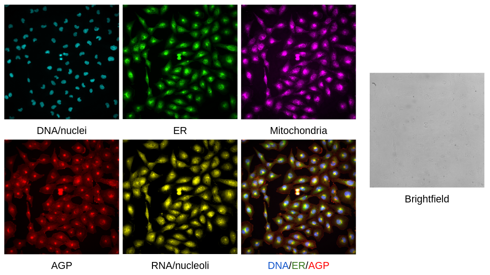

# Pediatric cancer atlas image profiling

[](https://doi.org/10.5281/zenodo.15548848)

In this repository, we perform image analysis to extract single cell morphological profiles and image-based profiling to format the profiles to be processed with machine learning and other analyses.

## Cell Painting

We performed a traditional [Cell Painting assay](https://www.nature.com/articles/nprot.2016.105) on multiple different pediatric cancer cell lines.
Images were acquired using an Opera Phenix 1 High Content Screening System.

In this assay, we have six channels (five Cell Painting + Brightfield). 
These channels are listed in the number order that you can find for the TIFF images, with the channel name in the XML file bolded:

1. **Brightfield high**
2. Concanavalin A **Alexa 488** - Endoplasmic reticulum (ER)
3. Phalloidin and WGA **Alexa 568** - Actin, Golgi, and plasma membrane (AGP)
4. MitoTracker **Alexa 647** - Mitochondria
5. **Hoechst 33342** - DNA/nucleus
6. SYTO14 **Alexa 488 long (CP)** - Cytoplasmic RNA and nucleoli 



## Data

### Pilot dataset

To assess the optimal seeding density and time point across all cell lines, we acquired multiple rounds of preliminary data with three plates per rounds.
Each round has a platemap layout, the same layout for three time points (24, 48, and 72 hours) per plate (e.g., 1 layout * 3 time points = 3 plates).
Per plate, there are five different seeding densities for each cell line with two replicate wells per density(1000, 2000, 4000, 8000, 12000).

Platemap files and visualizations can be found in the [metadata folder](./0.download_data/metadata/) inside the download data module.

**We will use various methods to determine what are the best conditions per cell line.**
One method we will perform in this repository is single-cell quality control (QC), in which we will output a QC report that can tell us which seeding densities and time points yielded the worst quality segmentations.
This can be due to high confluence or poor staining.
Another method is pairwise Pearson's correlation, which computes how similar wells are within the same cell line.

**NOTE:** All plate layouts contain U2-OS cell line. Also, any empty portions of the layout only contain media and no cells so they are not included on figure.

## Repository structure

| Module                                                    | Purpose                               | Description                                                                                                                                    |
| :-------------------------------------------------------- | :------------------------------------ | :--------------------------------------------------------------------------------------------------------------------------------------------- |
| [0.download_data](./0.download_data/)                     | Download plates and platemaps         | Download all relevant data (images, XML files, platemap files) to process. All metadata information will be found in this module.              |
| [1.illumination_correction](./1.illumination_correction/) | Save illumination correction function | Perform illumination correction on the raw images and extract the function as an `npy` to apply during feature extraction                      |
| [2.feature_extraction](./2.feature_extraction/)           | Extract morphology features           | Using CellProfiler, images are corrected, segmented for cell compartments and  features are extracted and outputted as SQLite files.           |
| [3.preprocessing_features](./3.preprocessing_features/)   | Preprocess morphology profiles        | Format the SQLite output into single-cell profiles and perform single-cell QC and pycytominer to get normalized and feature selected profiles. |
| [4.preliminary_results](./4.preliminary_results/)         | Generate exploratory data analysis    | Generate plots to explore the data for any interesting patterns or phenotypes (e.g., UMAP).                                                    |
| [5.optimization](./5.optimization/)                       | Determine optimal conditions          | Perform analyses to determine the best conditions for each cell line in the pilot datasets.                                                    |

## Environments

In this module, we include four different environments found in the [environments](./environments/) folder:

- **[CellProfiler environment](./cellprofiler_env.yml):** This environment is used for the illumination correction and feature extraction modules as we will be using CellProfiler v4.2.8 to perform these tasks.
- **[R environment](./r_environment.yml):** This environment is used for any notebook that requires visualization of results and figure generation in R language.
- **[Image profiling environment](./preprocessing_env.yml)**: This environment is used during the preprocessing module after we extract morphology features using CellProfiler, which includes installing relevant formatting software such as pycytominer, CytoTable, and coSMicQC.
- - **[Optimization environment](./r_environment.yml):** This environment is optimization analyses to determine best conditions (seeding density, time point, media) per cell line.

These environments can be installed either via conda or mamba.
Below is an example of how to install via the terminal.

```bash
# Make sure to be in the environments folder
mamba env create -f ...
```

## Citations

If you use or reference this work in your own projects, please cite us.
You can find citation information in the 'cite this repository' link at the top right under about section within GitHub.
This information may also be referenced within the [`CITATION.cff`](CITATION.cff) file.
